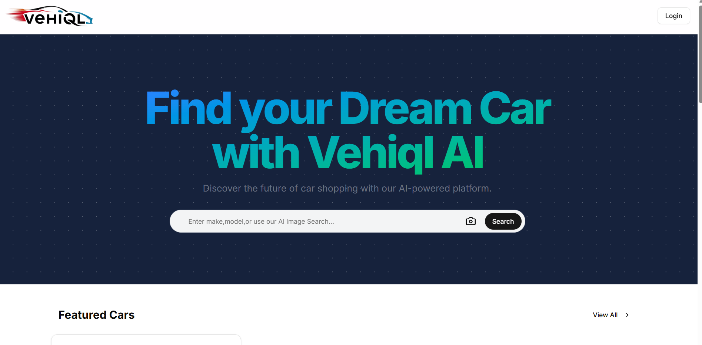
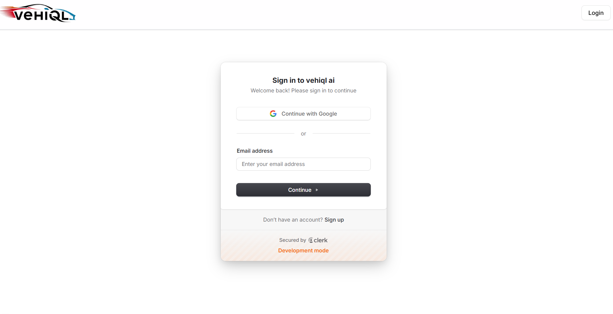
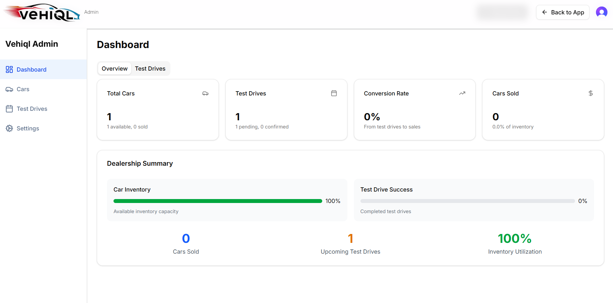

# Vehiql AI Powered Full-Stack Car Marketplace & Dealership Hub

Vehiql is a production-ready, full-stack web application designed for modern car dealerships and marketplaces. Built on a serverless architecture with Next.js 15, Vehiql integrates state-of-the-art **Google Gemini AI** for content extraction and semantic search, **Arcjet** for Web Application Firewall (WAF) shielding, and **Supabase** for database hosting and cloud storage.

This project was built to demonstrate advanced engineering patterns: type-safe database access, automated content generation, robust server-side security middleware, and polished, responsive UI design.

---

## 🛠️ The Tech Stack

An overview of the technologies, libraries, and tools utilized in this project:

| Category | Technology | Purpose |
| :--- | :--- | :--- |
| **Frontend & UI** | **Next.js 15 (App Router)** | Framework for Server Components (RSC) and serverless API routing. |
| | **React 19** | Library for building client-side interactive elements. |
| | **Tailwind CSS** | Styling engine for fluid layout and premium aesthetics. |
| | **Framer Motion** | Micro-animations and page transitions. |
| | **Lucide React** | Scalable, lightweight vector icons. |
| **Backend & DB** | **Node.js** | Server-side execution environment. |
| | **Prisma ORM** | Type-safe query building and database migration management. |
| | **PostgreSQL (Supabase)** | Relational database hosting with transaction-mode pooling. |
| **Security & Auth** | **Clerk** | Identity management, MFA, and user session controls. |
| | **Arcjet WAF** | Request shielding, bot detection, WAF rules, and token-bucket rate limiting. |
| **Artificial Intelligence** | **Google Gemini API** | Semantic image search and auto-filling listing forms using `gemini-flash-latest`. |
| **Cloud Storage** | **Supabase Storage** | CDN-backed storage buckets for high-resolution vehicle images. |
| **Tooling & DX** | **ESLint & Prettier** | Code quality checking and standard formatting. |
| | **Zod** | Client and server-side data schema validation. |

---

## 📸 System Architecture & Previews

### Client Dashboard & Search

*Homepage featuring search controls and AI image upload capability.*

### Authentication & Clerk Login

*Secure login and sign-up flow managed via Clerk integration.*

### Admin Portal & Inventory Management

*Dealer portal showing statistics, test-drive schedules, and car inventory controls.*

---

## 🌟 Architectural Features & Highlights

### 1. 🧠 Multimodal AI Integration (Gemini Flash)
* **Semantic Image Search**: Users can search for a vehicle by simply uploading an image. The backend calls the Gemini API to analyze the vehicle's make, color, and body style, returning matching database records.
* **AI-Assisted Listing Form**: Admins can upload a single image of a car; Gemini extracts all specifications (make, model, year, body type, transmission, fuel type, price, mileage) and auto-populates the form fields, reducing listing time.

### 2. 🛡️ Advanced Security Middleware (Arcjet)
* **Shielding & WAF Rules**: Configured to block cross-site scripting (XSS), SQL injection, and path traversal attacks before they reach Server Actions or database operations.
* **Bot Filtering**: Explicit WAF rules block search scrapers and malicious crawlers, while allowing standard search engine indexes (like Google Bot).
* **Token-Bucket Rate Limiting**: Implemented a server-side token bucket limiting AI processing endpoints to prevent API abuse.

### 3. 💾 Data Model & Indexing (Prisma + PostgreSQL)
* **Indexed Relational Schema**: Optimized search queries using database-level indexes on frequently queried fields (`make`, `model`, `bodyType`, `price`, `year`, `status`).
* **Relational Integrity**: Modeled complex relationships including user wishlists, saved cars, test-drive bookings, and dealership working hours.

### 💳 Interactive Financial Calculations
* **EMI Loan Calculator**: Integrates interactive amortization schedules directly into the listing detail pages, allowing buyers to customize interest rates, loan terms, and down payments.

---

## ⚙️ Environment Configuration

Create a `.env` (and `.env.local`) file in the root of your project and configure the following variables:

```env
# Database Connections (Supabase PostgreSQL)
DATABASE_URL=""
DIRECT_URL="postgresql:"

# Clerk Authentication (Settings -> API Keys)
NEXT_PUBLIC_CLERK_PUBLISHABLE_KEY=pk_test_...
CLERK_SECRET_KEY=sk_test_...
NEXT_PUBLIC_CLERK_SIGN_IN_URL=/sign-in
NEXT_PUBLIC_CLERK_SIGN_UP_URL=/sign-up
NEXT_PUBLIC_CLERK_AFTER_SIGN_IN_URL=/
NEXT_PUBLIC_CLERK_AFTER_SIGN_UP_URL=/

# Supabase Client Settings (Settings -> API)
NEXT_PUBLIC_SUPABASE_URL="..."
NEXT_PUBLIC_SUPABASE_ANON_KEY=...
SUPABASE_SERVICE_ROLE_KEY=...

# Security & Shielding (Arcjet Dashboard)
ARCJET_KEY=...

# AI Core Key (Google AI Studio)
GEMINI_API_KEY=...
```

---

## 💻 Local Development Setup

Follow these steps to run the project locally:

1. **Install Dependencies**:
   ```bash
   npm install
   ```

2. **Sync Database Schema**:
   Prisma will read your schema and sync the tables in your Supabase database:
   ```bash
   npx prisma db push
   ```

3. **Run the Development Server**:
   ```bash
   npm run dev
   ```
   Open [http://localhost:3000](http://localhost:3000) to view the application.

---

## ☁️ Vercel Deployment Instructions

Follow these steps to deploy Vehiql to **Vercel**:

### Step 1: Push Code to GitHub
1. Create a repository on GitHub.
2. Initialize and push your local codebase to the repository:
   ```bash
   git init
   git add .
   git commit -m "Initial commit"
   git branch -M main
   git remote add origin https://github.com/yourusername/vehiql.git
   git push -u origin main
   ```

### Step 2: Set Up Project on Vercel
1. Log in to [Vercel](https://vercel.com) and click **Add New** -> **Project**.
2. Import your GitHub repository.
3. In **Environment Variables**, expand the section and add all keys from your `.env.local` file (listed above).
4. Click **Deploy**.

### Step 3: Configure Build Settings & Prisma
Vercel automatically detects Next.js build settings. However, to ensure Prisma Client is generated during deployment:
1. Ensure your `package.json` contains the `postinstall` script:
   ```json
   "scripts": {
     "postinstall": "prisma generate"
   }
   ```
   *(This is already configured in the project's `package.json`)*. Vercel will automatically run this script on build, generating the client libraries for runtime server queries.
